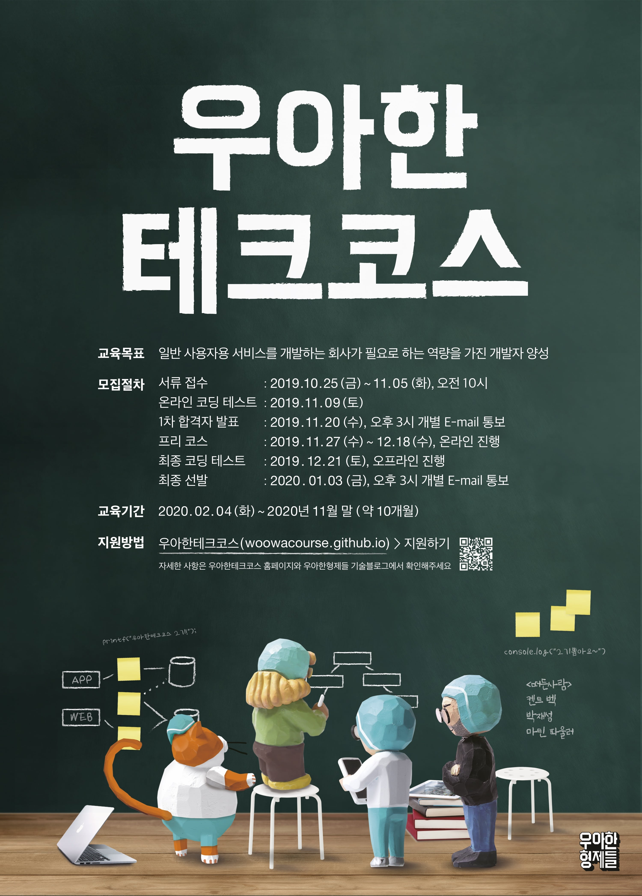

# 👨🏻‍💻 woowacourse-projects

    

>  [우아한테크코스](https://woowacourse.github.io/)에서 학습한 내용을 정리하는 Repository

 

## ⏳ Level 0 : 프리코스 + 오프라인 테스트

### 기간

- 프리코스: 2019.11.27 ~ 2019.12.17
- 오프라인 테스트: 2019.12.24

### 학습 목표

- [목적의식 있는 연습을 통한 효과적인 학습](https://brunch.co.kr/@javajigi/8)
- 선발 과정에서 지원자들의 성장을 유도

### 진행 미션

|     Project      |                          Repository                          |
| :--------------: | :----------------------------------------------------------: |
|  숫자 야구 게임  | [java-baseball-precourse](https://github.com/KimSeongGyu1/java-baseball-precourse) |
| 자동차 경주 게임 | [java-racingcar-precourse](https://github.com/KimSeongGyu1/java-racingcar-precourse) |
|      블랙잭      | [java-blackjack-precourse](https://github.com/KimSeongGyu1/java-blackjack-precourse) |
|      치킨 집      | [java-chicken-2019](https://github.com/KimSeongGyu1/java-chicken-2019) |

 

## 🥚 Level 1 : 프로그래밍 기본

### 기간

- 2020.02.04 ~ 2020.04.10

### 학습 목표

- 자바 프로그래밍 언어에 대한 기본 문법을 익혀 프로그래밍하는 경험을 한다.
- 읽기 좋은 코드를 구현하는 것이 왜 중요한지와 코드를 개선해 읽기 좋은 코드로 변경해 보는 경험을 한다.
- 자신이 구현한 코드에 대해 단위 테스트와 리팩토링하는 경험을 한다.
- 웹 프론트엔드에서 웹 백엔드까지 프로그래밍해 웹 애플리케이션을 개발하는 경험을 한다.

### 진행 미션

|     Project      |                          Repository                          |                         코드 리뷰                         |
| :--------------: | :----------------------------------------------------------: | :----------------------------------------------------------: |
|  문자열 계산기   | [java-calculator](https://github.com/KimSeongGyu1/java-calculator) | [코드 리뷰](https://github.com/woowacourse/java-calculator/pull/54) |
| 자동차 경주 게임 |  [java-racingcar](https://github.com/KimSeongGyu1/java-racingcar)  | [코드 리뷰](https://github.com/woowacourse/java-racingcar/pull/77) |
|   로또 / step1   | [java-lotto/step1](https://github.com/KimSeongGyu1/java-lotto/tree/YuanElly) | [코드 리뷰](https://github.com/woowacourse/java-lotto/pull/128) |
|   로또 / step2   | [java-lotto/step2](https://github.com/KimSeongGyu1/java-lotto) | [코드 리뷰](https://github.com/woowacourse/java-lotto/pull/221) |
|  블랙잭 / step1  | [java-blackjack/step1](https://github.com/KimSeongGyu1/java-blackjack/tree/firststep) | [코드 리뷰](https://github.com/woowacourse/java-blackjack/pull/39) |
|  블랙잭 / step2  | [java-blackjack/step2](https://github.com/KimSeongGyu1/java-blackjack) | [코드 리뷰](https://github.com/woowacourse/java-blackjack/pull/90) |
|   체스 / step1   | [java-chess/step1](https://github.com/KimSeongGyu1/java-chess/tree/kimseonggyu1) | [코드 리뷰](https://github.com/woowacourse/java-chess/pull/67) |
|   체스 / step2   | [java-chess/step2](https://github.com/KimSeongGyu1/java-chess) | [코드 리뷰](https://github.com/woowacourse/java-chess/pull/110) |
|   90년생 HTML    |            [html](https://github.com/KimSeongGyu1/html)            | 코드 리뷰 X: 단순 html 학습 미션  |
|   오프라인 코딩 테스트 다시   |            [java-chiken-after-level-1](https://github.com/KimSeongGyu1/java-chicken-2020)            | 코드 리뷰 X: 실력 향상 점검 미션 |

 

## 🐣 Level 2 : 웹 프로그래밍

### 기간

- 2020.04.21 ~ 2020.06.19

### 학습 목표

- Spring 프레임워크 기반으로 웹 애플리케이션을 개발하는 경험을 한다.
- TDD, ATDD 기반으로 웹 애플리케이션을 개발하고 리팩토링하는 경험을 한다.

### 진행 미션

|       Project        |                          Repository                          |                         Pull Request                         |
| :------------------: | :----------------------------------------------------------: | :----------------------------------------------------------: |
|     체스 / step1     | [jwp-chess/step1]() | [Pull Request]() |
|     체스 / step2     | [jwp-chess/step2]() | [Pull Request]() |
|     체스 / step3     | [jwp-chess/step3]() | [Pull Request]() |
|     체스 / step4     | [jwp-chess/step4]() | [Pull Request]() |
|   지하철 정보 관리   | [atdd-subway-admin]() | [Pull Request]() |
|   지하철 경로 조회   | [atdd-subway-path]() | [Pull Request]() |
| 지하철 경로 즐겨찾기 | [atdd-subway-favorite]() | [Pull Request]() |
|  지하철 Admin CRUD   | [atdd-subway-admin-frontend]() | [Pull Request]() |
|      Todo List       |        [todolist]()        |                       comming soon...                        |

 

## 🐥 Level 3 : 팀 프로젝트

### 기간

- 2020.07.07 ~ 2020.08.28

### 학습 목표

- 개발 프로세스 기반으로 프로젝트 진행, 협업하는 경험을 한다.
- 배포를 자동화하고, 피드백을 받아 지속적으로 개선하는 경험을 한다.

### 진행 미션

- comming soon...

 

## 🐓 Level 4 : 팀 프로젝트 유지 보수 및 웹 백엔드에 깊이를 더하는 단계

### 기간

- 2020.09.08 ~ 2020.11.27

### 학습 목표

- 웹 서버를 직접 구현해 HTTP를 이해하고, 서블릿 컨테이너의 동작 원리를 이해한다.
- JDBC 라이브러리, MVC, DI 프레임워크 구현을 통해 Spring 프레임워크의 동작 원리를 이해한다.
- 레거시 프로젝트를 리팩토링하는 경험을 한다.
- 객체지향 설계, 인증 및 보안, WebSocket 경험을 한다.
- 대용량 서비스를 위한 시스템 아키텍처 설계, 데이터 처리 경험을 한다.

### 진행 미션

- comming soon...

 

## 📹 Tecotalk : 크루들에게 지식을 공유하는 방법

### 발표 주제 : 10/7 예정

- [스프링]()

 

## 🖋 Writing : 글쓰기 코스

### 진행 미션

| Level |                 Topic                  |                          Repository                          |                         Pull Request                         |
| :---: | :------------------------------------: | :----------------------------------------------------------: | :----------------------------------------------------------: |
|   1   |      우아한테크코스 한 달 생활기       | [woowa-writing-2/level1]() | [Pull Request]() |
|   2   | 우테코에서 찾은 나만의 효과적인 학습법 | [woowa-writing-2/level2]() | [Pull Request]() |
|   3   |    내가 꿈꾸는 프로그래머로서의 삶     |                       comming soon...                        |                       comming soon...                        |
|   4   |       2기 크루들에게 보내는 편지       |                       comming soon...                        |                       comming soon...                        |

 

## 🗃 Javable : 우아한테크코스 코드 리뷰 모음 블로그

### 서비스

- [Javable](https://woowacourse.github.io/javable/)

### Github Repository

- [javable](https://github.com/woowacourse/javable)

### 활동 내용

- [포스팅 - 나의 글]()
